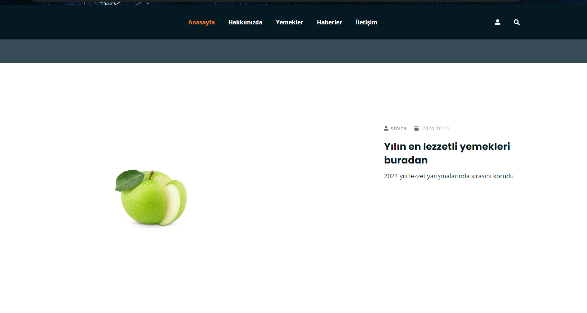
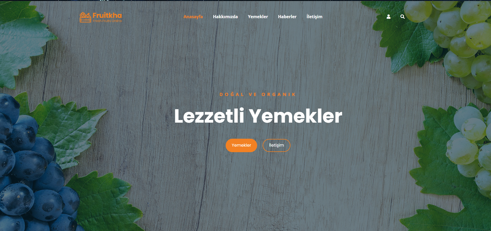
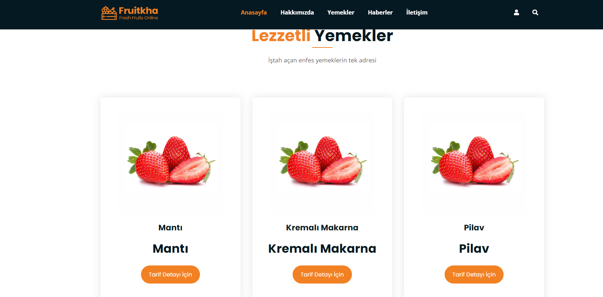
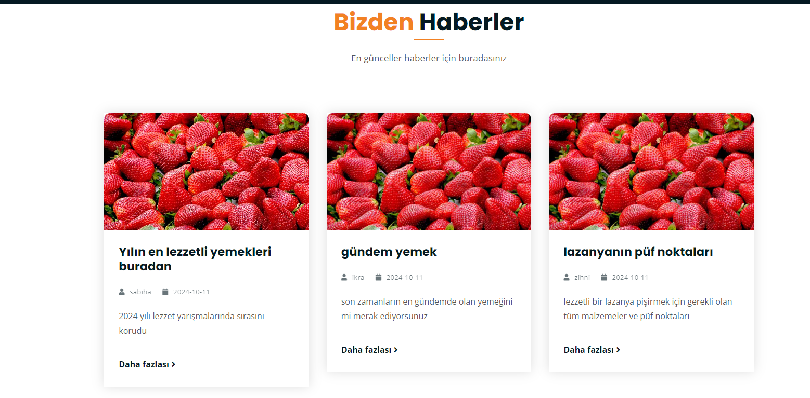
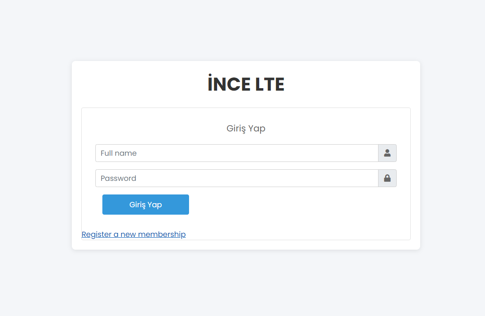
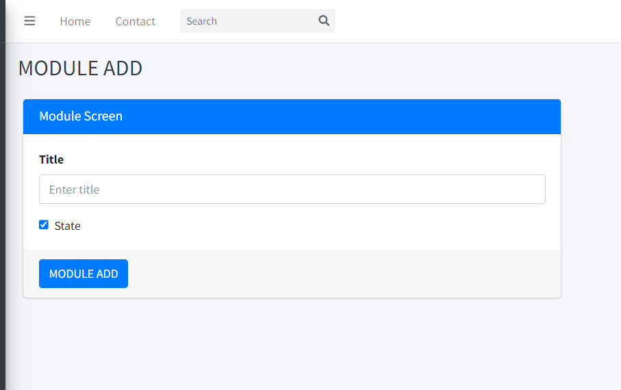
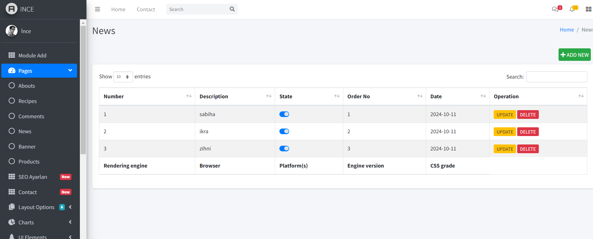
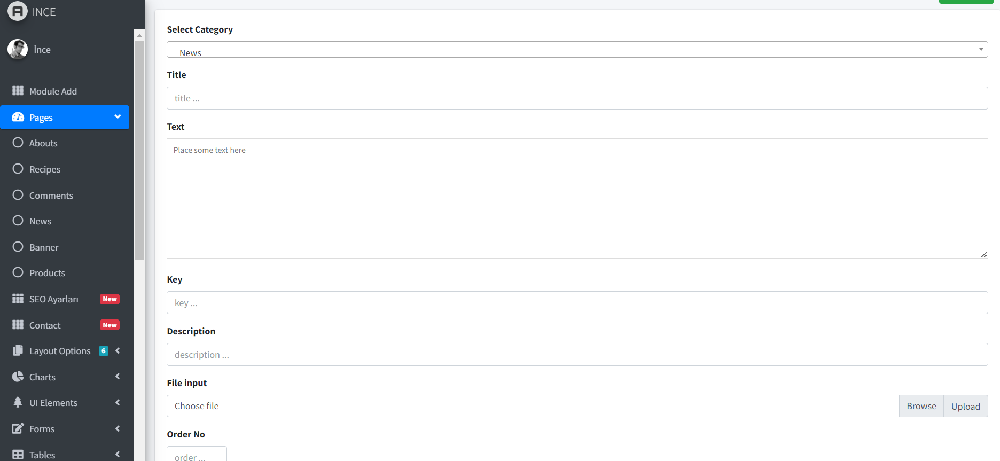

# Yönetim Panelli Web Sitesi

Yemek Tariflerinin yer aldığı aynı zamanda bununla ilgili haberlerin bulunduğu bir web sitesi.

## Sayfalar:

1. Hakkımızda
2. Yorumlar
3. İletişim
4. Yemekler
5. Haberler
6. Referanslar

### Yemekler ve Haberler sayfasının detay sayfaları vardır. Bir yemek veya haberin detayını öğrenmek için bu sayfalara yönlendirilir.

## YÖnetim Paneli - Login

## YÖnetim Paneli - Register

## YÖnetim Paneli - Module Ekleme Sayfası:

Bu sayfadan kullanılacak sayfalar eklenir böylelikle veritabanına gidip ayrıca bir işlem yapmaya gerek yoktur.

## YÖnetim Paneli - Sayfalar:

Oluşturulan sayfalarda listeleme - ekleme - güncelleme ve silme işlemleri mevcuttur.

Ekleme ve güncelleme sayfaları yapı olarak aynıdır. Fark ise güncelleme sayfasında güncellenecek veriler getirilir.
